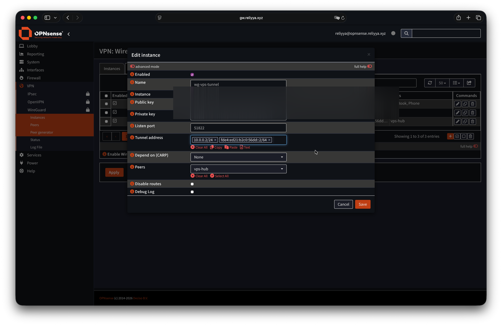
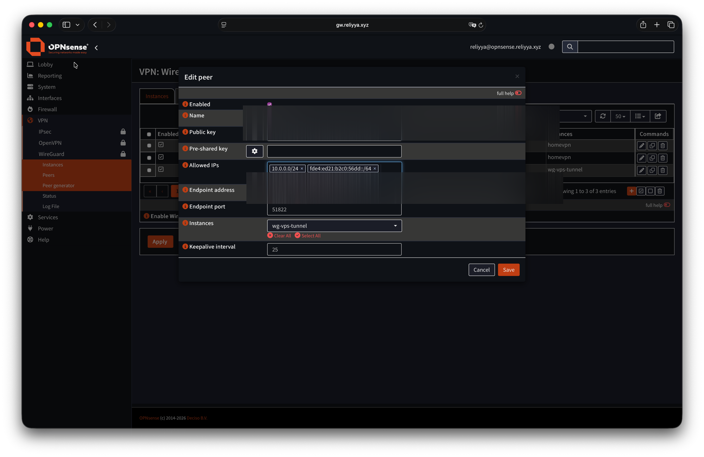
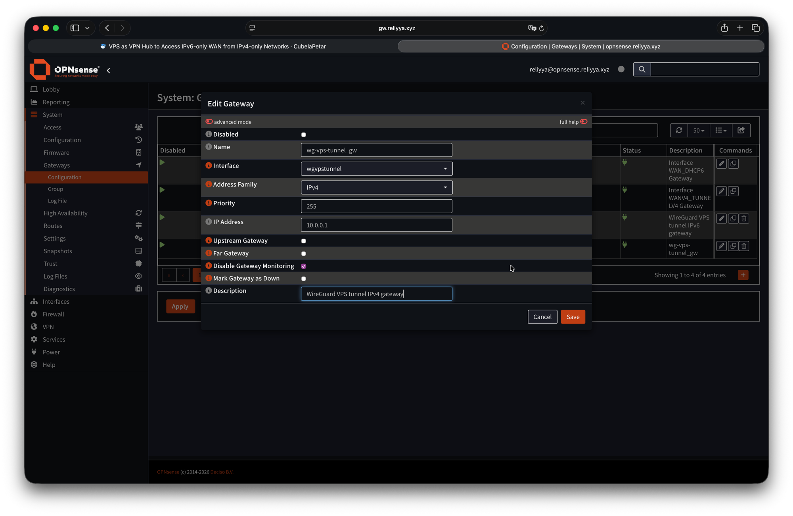
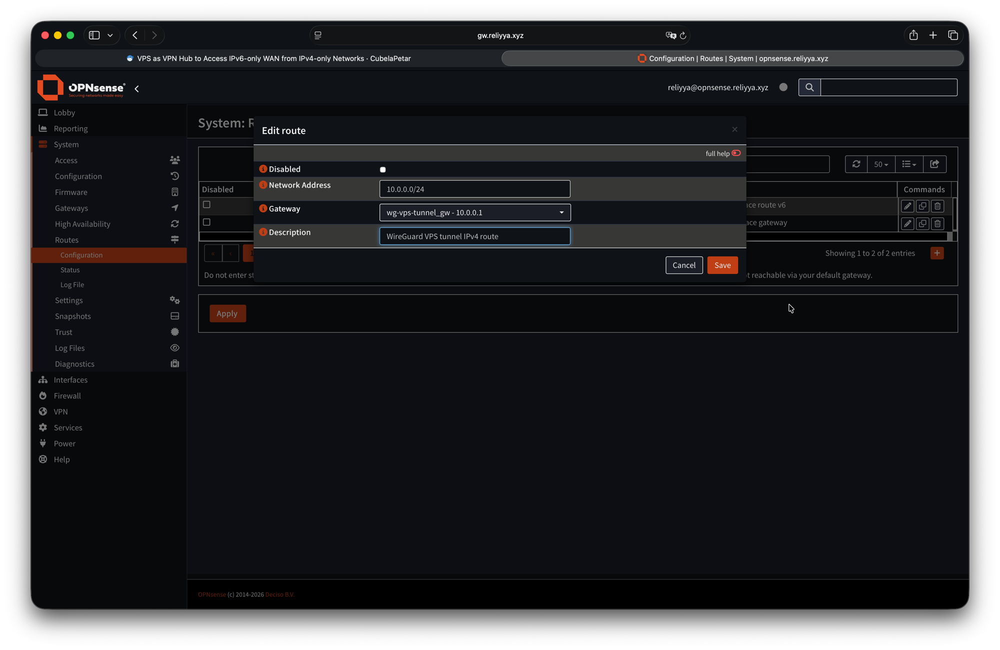
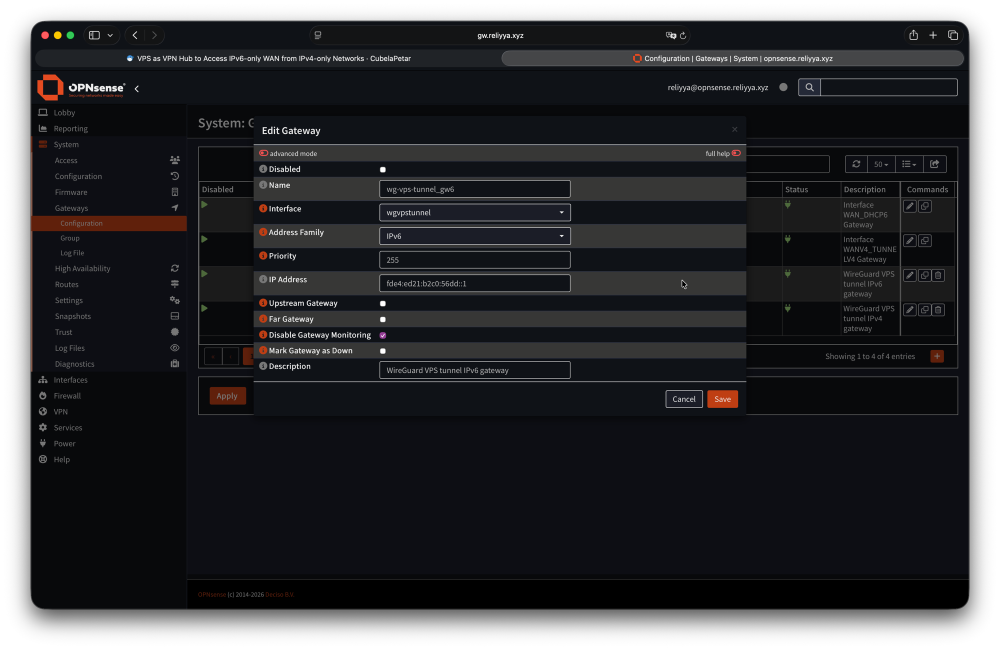
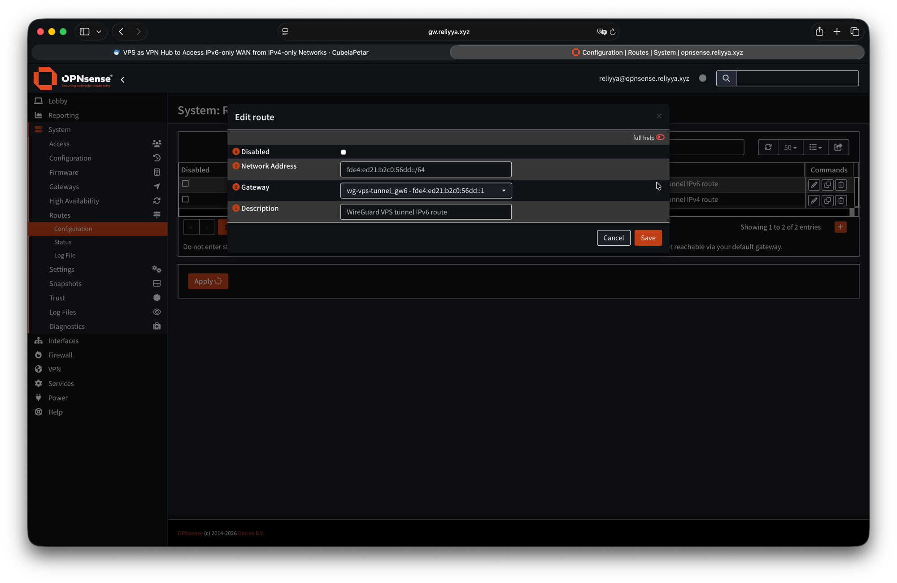

## Einleitung

Ich schreibe das gerade in einem Zug nach Zürich, im WLAN des Zuges — einem reinen IPv4-Netz. Und trotzdem erreiche ich alle meine Heimdienste per VPN, obwohl mein Heimnetzwerk hinter einer DS-Lite-Verbindung steckt und keine öffentliche IPv4 hat. Wie man OPNsense damit einrichtet, beschreibe ich in einem [anderen Artikel](posts/opnsense-ds-lite/index.md).

Die Lösung: ein VPS mit Dual-Stack als WireGuard-Hub. Mein Heimrouter verbindet sich über IPv6 mit dem VPS, ich verbinde mich von überall über die öffentliche IPv4 des VPS. Gebraucht habe ich das hauptsächlich für die Arbeit — bei uns im Büro gibt es nur IPv4, und ich wollte Zugriff auf meinen selbst gehosteten LLM-Server zu Hause. Ich habe das Problem mit Claude besprochen, der einen Site-to-Site-WireGuard-Tunnel zwischen Heimnetz und VPS über IPv6 vorschlug — Road Warriors verbinden sich dann über IPv4 mit dem VPS.

## Überblick

Das Ergebnis: Ich erreiche jede Heimadresse aus einem IPv4-only-Netz — auch VLANs, die nur IPv6 haben. Es läuft seit der Einrichtung stabil.

Der VPS ist der Hub:

```
[Heimnetz 10.56.0.0/20 + fde4:ed21:b2c0:5600::/56]     [Road Warrior]
        |                                                       |
  [OPNsense Firewall]                                  WireGuard Client
   WireGuard Peer                                       10.0.0.3/24
   10.0.0.2/24                                    fde4:ed21:b2c0:56dd::3/64
   fde4:ed21:b2c0:56dd::2/64                               |
        |                                                   |
        └──── IPv6-Tunnel ──────[VPS]────── IPv4-Tunnel ───┘
                          10.0.0.1/24
                    fde4:ed21:b2c0:56dd::1/64
                         WireGuard Hub
```

---

## Netzwerkplan

|Rolle|Gerät|WireGuard IPv4|WireGuard IPv6 (ULA)|Öffentlicher Endpunkt|
|---|---|---|---|---|
|**Hub**|VPS|`10.0.0.1/24`|`fde4:ed21:b2c0:56dd::1/64`|`VPS_PUBLIC_IPv4` (statisch) / `VPS_PUBLIC_IPv6` (statisch)|
|**Heimgateway**|OPNsense|`10.0.0.2/24`|`fde4:ed21:b2c0:56dd::2/64`|`vpn.petarcubela.de` (dynamisches IPv6 via DDNS)|
|**Road Warrior**|Laptop/PC|`10.0.0.3/24`|`fde4:ed21:b2c0:56dd::3/64`|`CLIENT_PUBLIC_IPv4` (IPv4)|

- **Heimnetz IPv4-Subnetz:** `10.56.0.0/20` (umfasst alle Heim-VLANs)
- **Heimnetz IPv6-ULA-Block:** `fde4:ed21:b2c0:5600::/56` (umfasst alle Heim-VLANs)
- **WireGuard-Tunnel IPv4-Subnetz:** `10.0.0.0/24`
- **WireGuard-Tunnel IPv6-Subnetz:** `fde4:ed21:b2c0:56dd::/64`
- **WireGuard-Port:** `51822/udp`

---

## Teil 1 — VPS-Einrichtung



Alle folgenden Befehle werden als `root`-Benutzer ausgeführt.



### 1.1 Schlüssel generieren

Das Schlüsselpaar mit `wg` generieren und im Standard-WireGuard-Verzeichnis ablegen. Der private Schlüssel braucht eingeschränkte Berechtigungen.
```bash
wg genkey | tee /etc/wireguard/vps_private.key | wg pubkey > /etc/wireguard/vps_public.key
chmod 600 /etc/wireguard/vps_private.key
```

### 1.2 IP-Weiterleitung aktivieren

Da der VPS Pakete zwischen dem Tunnel und dem Internet weiterleiten muss, IP-Weiterleitung aktivieren:

```bash
cat >> /etc/sysctl.conf << 'EOF'
net.ipv4.ip_forward=1
net.ipv6.conf.all.forwarding=1
EOF
sysctl -p
```

### 1.3 WireGuard-Konfiguration `/etc/wireguard/wg0.conf`

Die `PostUp`-Hooks werden nach dem Hochfahren des Interfaces ausgeführt und erledigen zwei Dinge: Sie öffnen die Kernel-Firewall für weitergeleiteten Traffic (`FORWARD`-Regeln) und aktivieren NAT für ausgehenden IPv4-Traffic über das physische Interface (`MASQUERADE` auf `eth0`). Die `PreDown`-Hooks machen dies vor dem Herunterfahren des Interfaces sauber rückgängig. Sowohl die `FORWARD`-Regeln als auch die sysctl-Einstellungen aus §1.2 sind erforderlich: sysctl aktiviert die IP-Weiterleitung auf Kernel-Ebene, aber die Firewall (UFW setzt die Forward-Policy standardmäßig auf `DROP`) blockiert weitergeleitete Pakete weiterhin, bis die `FORWARD`-Chain explizit geöffnet wird.

Es gibt keine IPv6-`MASQUERADE`-Regel, weil dieses Setup ULA-Adressen (`fd...`) verwendet — sie werden nur innerhalb des WireGuard-Tunnels geroutet und verlassen den VPS nie in Richtung Internet.

Vor dem Speichern dieser Konfiguration den Namen des Internet-Interfaces mit `ip -br link` prüfen und `eth0` bei Bedarf ersetzen (übliche Alternativen: `ens3`, `ens18`, `venet0`).

```ini
[Interface]
Address    = 10.0.0.1/24, fde4:ed21:b2c0:56dd::1/64
ListenPort = 51822
PrivateKey = <vps-private-key>
# MTU = 1360   # auskommentieren bei Problemen mit großen Dateiübertragungen

# eth0 durch das eigene Internet-Interface ersetzen
PostUp   = iptables -A FORWARD -i wg0 -j ACCEPT
PostUp   = iptables -A FORWARD -o wg0 -j ACCEPT
PostUp   = iptables -t nat -A POSTROUTING -o eth0 -j MASQUERADE
PostUp   = ip6tables -A FORWARD -i wg0 -j ACCEPT
PostUp   = ip6tables -A FORWARD -o wg0 -j ACCEPT
PreDown  = iptables -D FORWARD -i wg0 -j ACCEPT
PreDown  = iptables -D FORWARD -o wg0 -j ACCEPT
PreDown  = iptables -t nat -D POSTROUTING -o eth0 -j MASQUERADE
PreDown  = ip6tables -D FORWARD -i wg0 -j ACCEPT
PreDown  = ip6tables -D FORWARD -o wg0 -j ACCEPT

# ── Heimnetz (OPNsense) ───────────────────────────────────────────
[Peer]
PublicKey  = <opnsense-public-key>
# Kein Endpoint — OPNsense initiiert die Verbindung, VPS lernt die Adresse dynamisch
# AllowedIPs: Tunnel-IPs + gesamtes Heimnetz-IPv4-LAN + gesamter Heimnetz-ULA-/56-Block
AllowedIPs = 10.0.0.2/32, fde4:ed21:b2c0:56dd::2/128, 10.56.0.0/20, fde4:ed21:b2c0:5600::/56

# ── Road Warrior / Client ─────────────────────────────────────────
[Peer]
PublicKey  = <client-public-key>
AllowedIPs = 10.0.0.3/32, fde4:ed21:b2c0:56dd::3/128
# Kein Endpoint nötig — Client initiiert die Verbindung
```

OPNsense erscheint hier wie jeder andere WireGuard-Peer. Was dieses Setup zum Site-to-Site-Tunnel macht — statt einem gewöhnlichen Client-VPN — sind die `AllowedIPs` für den OPNsense-Peer: Durch die Aufnahme der gesamten Heimnetz-Subnetze (`10.56.0.0/20` und `fde4:ed21:b2c0:5600::/56`) erstellt der VPS Routing-Tabelleneinträge für diese Prefixe, die auf OPNsense zeigen. In WireGuard fungiert `AllowedIPs` sowohl als Route als auch als ACL: Pakete für diese Subnetze werden an OPNsense gesendet, und nur Pakete aus diesen Subnetzen werden von OPNsense akzeptiert.

### 1.4 Aktivieren und starten

Den Tunnel aktivieren:
```bash
systemctl enable --now wg-quick@wg0
wg show   # Interface und Peers überprüfen
```

### 1.5 UFW-Firewall

Ich nutze `ufw` auf meinem VPS. Zunächst den WireGuard-Port freischalten:
```bash
ufw allow 51822/udp comment "WireGuard"
```

Falls UFW noch nicht aktiv ist, sicherstellen, dass Port 22/TCP erlaubt ist, bevor `ufw enable` ausgeführt wird — sonst sperrt man sich aus der SSH-Verbindung aus.

Außerdem muss UFW die Paketweiterleitung erlauben. `/etc/default/ufw` bearbeiten und die Forward-Policy ändern:
```
DEFAULT_FORWARD_POLICY="ACCEPT"
```

Dann UFW neu laden:
```bash
ufw reload
```

---

## Teil 2 — OPNsense (Heimgateway)

Alle Schritte werden in der OPNsense-Weboberfläche durchgeführt.

### 2.1 WireGuard-Instanz erstellen

**VPN → WireGuard → Instances → Add**

|Feld|Wert|
|---|---|
|Name|`wg-vps-tunnel`|
|Listen Port|`51822`|
|Tunnel Address|`10.0.0.2/24`, `fde4:ed21:b2c0:56dd::2/64`|
|Generate keypair| öffentlichen Schlüssel für die VPS-Konfiguration kopieren|



### 2.2 VPS als Peer hinzufügen

**VPN → WireGuard → Peers → Add**

|Feld|Wert|
|---|---|
|Name|`vps-hub`|
|Public Key|`<vps-public-key>`|
|Endpoint Address|`VPS_PUBLIC_IPv6`|
|Endpoint Port|`51822`|
|Allowed IPs|`10.0.0.0/24`, `fde4:ed21:b2c0:56dd::/64`|
|Keepalive|`25`|

> Die **IPv6-Adresse** des VPS als Endpunkt verwenden — die Verbindung Heimnetz→VPS läuft über IPv6, da das Heimnetz keine öffentliche IPv4 hat.
>
> Ein `Keepalive` von 25 Sekunden ist notwendig, weil OPNsense hinter dem DS-Lite-CGNAT sitzt. WireGuard ist bei Inaktivität vollständig still, und NAT-State-Tabellen lassen UDP-Mappings typischerweise nach 25–30 Sekunden ablaufen. Ein Keepalive-Paket alle 25 Sekunden hält das Mapping aktiv und stellt sicher, dass OPNsense jederzeit Pakete vom VPS empfangen kann.



### 2.3 WireGuard-Interface zuweisen

**Interfaces → Assignments** → das neue `wg`-Interface zuweisen und aktivieren.

### 2.4 Gateway hinzufügen

**System → Gateways → Configuration → Add**

|Feld|Wert|
|---|---|
|Name|`wg-vps-tunnel_gw`|
|Interface|`wgvpstunnel`|
|Address Family|`IPv4`|
|IP Address|`10.0.0.1`|
|Disable Gateway Monitoring|✅|
|Description|`WireGuard VPS Tunnel IPv4 Gateway`|

> OPNsense erstellt für WireGuard-Interfaces nicht automatisch eine Connected-Route (anders als Linux). Das Gateway-Objekt muss man manuell anlegen.



### 2.5 Statische Route hinzufügen

**System → Routes → Configuration → Add**

|Feld|Wert|
|---|---|
|Network Address|`10.0.0.0/24`|
|Gateway|`wg-vps-tunnel_gw - 10.0.0.1`|
|Description|`WireGuard VPS Tunnel IPv4 Route`|

> Diese Route ist erforderlich. Ohne sie weiß OPNsense nicht, dass Return-Traffic für `10.0.0.0/24` zurück in den Tunnel geleitet werden soll.



### 2.6 IPv6-Gateway hinzufügen

**System → Gateways → Configuration → Add**

|Feld|Wert|
|---|---|
|Name|`wg-vps-tunnel_gw6`|
|Interface|`wgvpstunnel`|
|Address Family|`IPv6`|
|IP Address|`fde4:ed21:b2c0:56dd::1`|
|Disable Gateway Monitoring|✅|
|Description|`WireGuard VPS Tunnel IPv6 Gateway`|



### 2.7 IPv6-statische Route hinzufügen

**System → Routes → Configuration → Add**

|Feld|Wert|
|---|---|
|Network Address|`fde4:ed21:b2c0:56dd::/64`|
|Gateway|`wg-vps-tunnel_gw6 - fde4:ed21:b2c0:56dd::1`|
|Description|`WireGuard VPS Tunnel IPv6 Route`|



### 2.8 Firewallregeln

**Firewall → Rules → [wgvpstunnel-Interface] → Add** (IPv4 — Tunnel-Subnetz erlauben)

|Feld|Wert|
|---|---|
|Action|Pass|
|TCP/IP Version|IPv4|
|Source|`10.0.0.0/24`|
|Destination|`10.0.0.0/24`|

OPNsense blockiert standardmäßig den gesamten Traffic auf neuen Interfaces, sodass selbst bei aufgebautem Tunnel keine Pakete fließen, bis eine Pass-Regel vorhanden ist. Ohne diese Regel schlägt ein `ping 10.0.0.2` vom VPS fehl, was eine Überprüfung der Tunnel-Konnektivität unmöglich macht. Die Regel erlaubt jedem Host im Tunnel-Subnetz, jeden anderen Host im gleichen Subnetz zu erreichen — einschließlich OPNsenses eigener Tunnel-IP `10.0.0.2`.

**Firewall → Rules → [wgvpstunnel-Interface] → Add** (IPv4 — Zugriff auf Heimnetz erlauben)

|Feld|Wert|
|---|---|
|Action|Pass|
|TCP/IP Version|IPv4|
|Source|`10.0.0.0/24`|
|Destination|`10.56.0.0/20`|

**Firewall → Rules → [wgvpstunnel-Interface] → Add** (IPv6 — Zugriff auf Heimnetz-ULA erlauben)

|Feld|Wert|
|---|---|
|Action|Pass|
|TCP/IP Version|IPv6|
|Source|`fde4:ed21:b2c0:56dd::/64`|
|Destination|`fde4:ed21:b2c0:5600::/56`|

**Firewall → Rules → LAN → Add**

|Feld|Wert|
|---|---|
|Action|Pass|
|TCP/IP Version|IPv4+IPv6|
|Source|`10.56.0.0/20` / `fde4:ed21:b2c0:5600::/56`|
|Destination|`10.0.0.0/24` / `fde4:ed21:b2c0:56dd::/64`|

---

## Teil 3 — Road Warrior / Client

### 3.1 Schlüssel generieren

**Linux/macOS:**

```bash
wg genkey | tee client_private.key | wg pubkey > client_public.key
```

**Windows:** Die offizielle WireGuard-GUI verwenden — sie generiert das Schlüsselpaar automatisch.

### 3.2 WireGuard-Konfiguration `client.conf`

```ini
[Interface]
Address    = 10.0.0.3/24, fde4:ed21:b2c0:56dd::3/64
PrivateKey = <client-private-key>
# DNS: OPNsense MGMT Interface (IPv4 + IPv6)
DNS        = 10.56.0.1, fde4:ed21:b2c0:5600::254
# MTU = 1360   # auskommentieren bei Problemen mit großen Dateiübertragungen

[Peer]
PublicKey           = <vps-public-key>
Endpoint            = VPS_PUBLIC_IPv4:51822
AllowedIPs          = 10.0.0.0/24, 10.56.0.0/20, fde4:ed21:b2c0:56dd::/64, fde4:ed21:b2c0:5600::/56
PersistentKeepalive = 25
```

`AllowedIPs` leitet den Tunnel-Traffic, das gesamte Heimnetz-IPv4-LAN, das Tunnel-IPv6-Subnetz und den gesamten Heimnetz-ULA-`/56`-Block über den VPS. Internet-Traffic bleibt lokal auf dem Client (Split Tunnel).

`fde4:ed21:b2c0:56dd::/64` liegt innerhalb von `fde4:ed21:b2c0:5600::/56` — das `/56` deckt `5600::` bis `56ff::` ab, sodass `56dd` bereits enthalten ist. Man könnte den `/64`-Eintrag weglassen, und das `/56` allein würde ihn abdecken, aber beide Einträge machen die Absicht explizit: `56dd::/64` ist das VPN-Tunnel-Subnetz, `5600::/56` ist der ULA-Block des Heimnetzes. WireGuard löst die Überschneidung über Longest-Prefix-Matching auf.

### 3.3 Client-Peer zum VPS hinzufügen

Sobald der öffentliche Schlüssel des Clients vorliegt, diesen zum VPS hinzufügen:

```bash
# Live hinzufügen ohne bestehende Verbindungen zu unterbrechen
wg set wg0 peer <client-public-key> allowed-ips 10.0.0.3/32,fde4:ed21:b2c0:56dd::3/128

# In Konfiguration persistieren
wg-quick save wg0
```

---

## Überprüfung

### Auf dem VPS

```bash
# Tunnel-Status und Peer-Handshakes prüfen
wg show

# Erfolgreicher Output zeigt aktuellen Handshake und Datentransfer:
# peer: <opnsense-pubkey>
#   latest handshake: 14 seconds ago
#   transfer: 1.23 MiB received, 456 KiB sent

# OPNsense-Tunnel-IPs anpingen
ping 10.0.0.2
ping6 fde4:ed21:b2c0:56dd::2

# Ein Gerät im Heimnetz anpingen (IPv4 + IPv6 ULA)
ping 10.56.0.1
ping6 fde4:ed21:b2c0:5600::254

# Client-Tunnel-IPs anpingen (sobald Client-Peer verbunden ist)
ping 10.0.0.3
ping6 fde4:ed21:b2c0:56dd::3
```

### Vom Road Warrior / Client

```bash
# VPS-Tunnel-IPs anpingen
ping 10.0.0.1
ping6 fde4:ed21:b2c0:56dd::1

# OPNsense-Tunnel-IPs anpingen
ping 10.0.0.2
ping6 fde4:ed21:b2c0:56dd::2

# Ein Gerät im Heimnetz per IPv4 anpingen
ping 10.56.0.1

# Ein Heimgerät mit ausschließlich ULA-IPv6-Adresse anpingen
ping6 fde4:ed21:b2c0:5601::<address>   # z.B. ein Gerät im Server-VLAN
```

### Paketanalyse (auf dem VPS)

```bash
# ICMP-Traffic auf dem Tunnel-Interface beobachten
tcpdump -i wg0 icmp

# Wenn Echo Request sichtbar, aber kein Echo Reply:
# → Paket erreicht den Tunnel, aber OPNsense blockiert es (Firewallregeln prüfen)
# Wenn gar nichts sichtbar:
# → Paket tritt nicht in den Tunnel ein (AllowedIPs und Routing prüfen)
```

---

## Quellen

- [How to setup WireGuard on Ubuntu 20.04](https://www.digitalocean.com/community/tutorials/how-to-set-up-wireguard-on-ubuntu-20-04)
