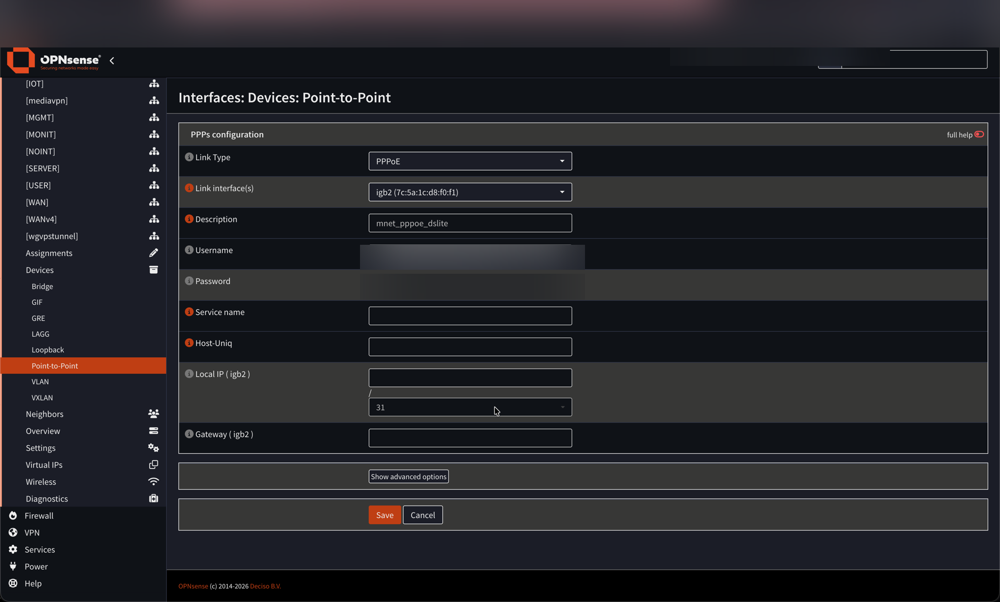
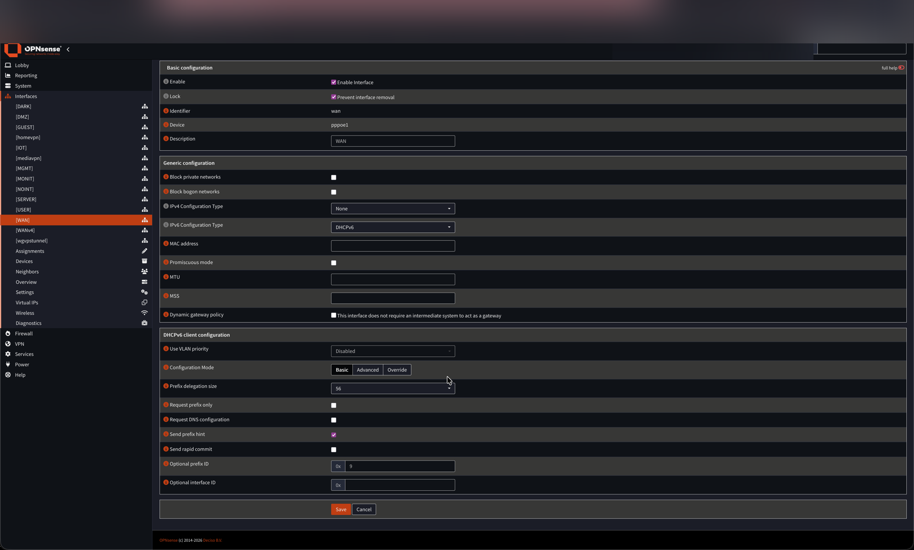
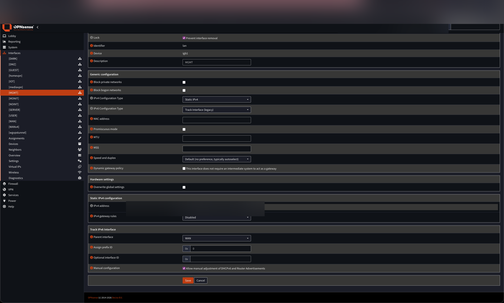
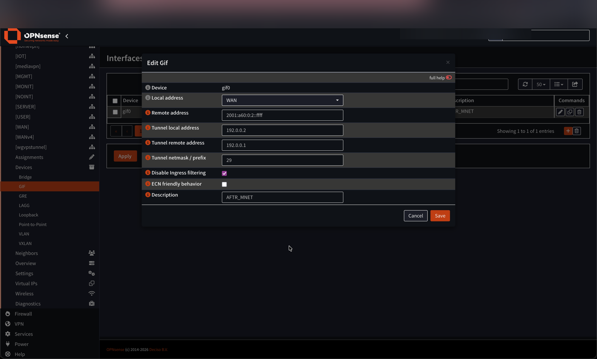
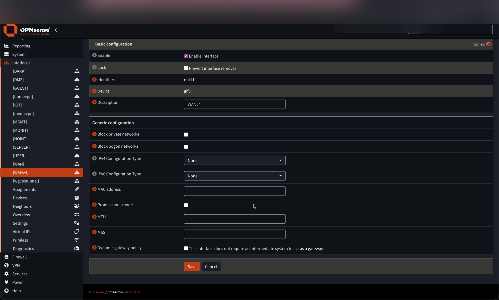
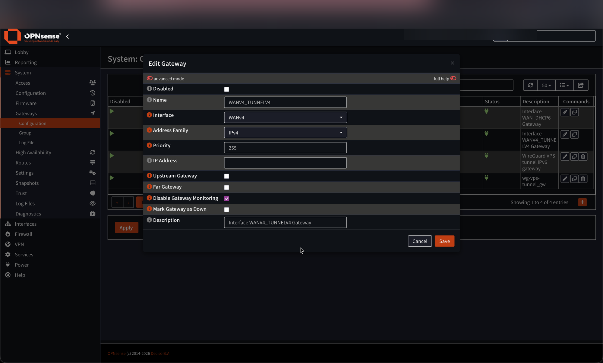

## Introduction

I have a DS-Lite connection at home, provided by M-Net. I run an OPNsense firewall and needed the two to work together. My first instinct was to call the ISP and ask for a proper dual-stack setup with a real public IPv4 address, mainly because of VPN access problems from IPv4-only networks. But I decided to take that as a challenge instead: embrace IPv6, deal with the constraints of DS-Lite, and find solutions around the remaining gaps. There is a follow-up article on how to access a DS-Lite home network from an IPv4-only network using a VPS as a WireGuard hub.

OPNsense does support DS-Lite, but it takes a specific setup and there are a few non-obvious gotchas. This article walks through the full configuration.


This guide uses **M-Net** as the example ISP. M-Net is a German regional provider. The VLAN ID (40), AFTR address, and PPPoE username format are M-Net-specific — your ISP may differ. The overall approach is the same for any DS-Lite connection, but double-check these values with your provider.


## What is DS-Lite?

DS-Lite (Dual-Stack Lite, [RFC 6333](https://datatracker.ietf.org/doc/html/rfc6333)) is a transition technology that lets ISPs hand out IPv6 to their customers while conserving public IPv4 addresses. From the customer's perspective it looks like this:

- You get a **public, routable IPv6 prefix** (in my case a /56 from M-Net, delegated via DHCPv6).
- You get **no public IPv4 address**. Instead, your IPv4 traffic is tunnelled through the IPv6 connection to a device called the **AFTR** (Address Family Transition Router) at the ISP. The AFTR then NATes all customers' traffic behind shared public IPv4 addresses (CGNAT, [RFC 6598](https://datatracker.ietf.org/doc/html/rfc6598)).

The tunnel between your router and the AFTR is a **GIF** (Generic IPv6-over-IPv6 tunnel, or more precisely IPv4-in-IPv6). Inside the tunnel, both endpoints use addresses from the reserved `192.0.0.0/29` block ([RFC 6333 §10](https://datatracker.ietf.org/doc/html/rfc6333#section-10)):

| Address | Role |
|---|---|
| `192.0.0.2` | Your router (B4 element) |
| `192.0.0.1` | ISP AFTR gateway |

The practical downsides: you lose a real public IPv4, so port forwarding is impossible, and VPN protocols that rely on incoming IPv4 connections need a workaround. Every host and service behind the router should ideally be reachable over IPv6 directly.

## Prerequisites

- OPNsense (tested on 24.x)
- A DSL modem in bridge mode — M-Net requires VLAN 40 on the WAN. A DrayTek Vigor 166 works well for this; a FritzBox also works.
- Your M-Net PPPoE credentials (username and password from the customer portal)
- The AFTR IPv6 address for M-Net: `2001:a60:0:2::ffff` (hostname `aftr.prod.m-online.net` — you must resolve it yourself, OPNsense only accepts an IP address in the GIF config)

## Step 1: Modem Setup

Make sure your modem is in bridge mode so OPNsense receives the raw PPPoE frames and handles the connection itself. M-Net requires VLAN 40 — verify your modem passes it through correctly.

## Step 2: Create the PPPoE Device

In OPNsense, go to **Interfaces → Devices → Point-to-Point**.

Add a new entry:

| Field | Value |
|---|---|
| Link Type | `PPPoE` |
| Link Interface(s) | Your WAN physical port (e.g. `igb2`) |
| Username | Your M-Net username (format: `XXXXXXX@mdsl.mnet-online.de`) |
| Password | Your M-Net password |
| Description | `mnet_pppoe_dslite` |

Leave all other fields at their defaults. Save and apply.

A new device `pppoe1` (or `pppoe0` if this is the first) will appear in the device list.

## Step 3: Assign and Configure the WAN Interface

Go to **Interfaces → Assignments** and make sure the **WAN** interface is assigned to the newly created PPPoE device (`pppoe1`).

Then open **Interfaces → WAN** and configure it as follows:

**IPv4 Configuration Type** → `None`
DS-Lite does not give you a real IPv4 on the WAN interface — IPv4 will come through the GIF tunnel in a later step.

**IPv6 Configuration Type** → `DHCPv6`
This establishes the IPv6 connection over the PPPoE link and requests the prefix delegation from M-Net.

Under **DHCPv6 client configuration**, set:

| Field | Value |
|---|---|
| Prefix Delegation Size | `56` |
| Send prefix hint | ✓ enabled |
| Optional Prefix ID | `9` |

The Prefix ID determines which sub-prefix of the delegated /56 the WAN interface itself uses for its own IPv6 address. Setting it to `9` reserves one /64 for the WAN and leaves the rest for LAN and VLANs — this also means the WAN interface gets a routable Global Unicast Address (GUA), which matters for the GIF tunnel in Step 5.

Save and apply. OPNsense will now establish the PPPoE connection and request an IPv6 /56 prefix from M-Net.

## Step 4: Track IPv6 on LAN and VLANs

For each internal interface (LAN, VLANs), go to **Interfaces → [Interface]** and set:

| Field | Value |
|---|---|
| IPv6 Configuration Type | `Track Interface (legacy)` |
| Parent Interface | `WAN` |
| Assign Prefix ID | A unique value per interface (e.g. `0` for LAN, `1`–`8` for VLANs) |

This tells OPNsense to derive the IPv6 address of each interface from the /56 block delegated to WAN. Each Prefix ID maps to a distinct /64 within the /56.

At this point you should have working IPv6 connectivity. Test with `ping6 2620:fe::fe` (Quad9) from the OPNsense shell or from a host behind it. If IPv6 works, move on to the IPv4 tunnel.

## Step 5: Create the GIF Tunnel

The GIF tunnel carries your IPv4 traffic inside IPv6 packets to M-Net's AFTR.

Go to **Interfaces → Devices → GIF**.

Add a new entry:

| Field | Value |
|---|---|
| Local address | `WAN` (or any interface with a GUA — see note below) |
| Remote address | `2001:a60:0:2::ffff` |
| Tunnel local address | `192.0.0.2` |
| Tunnel remote address | `192.0.0.1` |
| Tunnel netmask / prefix | `29` |
| Disable Ingress filtering | ✓ enabled |
| Description | `AFTR_MNET` |

**Which interface to use as local address?**
The GIF tunnel needs a **Global Unicast Address (GUA)** as its IPv6 source — a link-local address is not routable and will not reach the AFTR. Because we set a Prefix ID (`9`) on the WAN DHCPv6 client in Step 3, the WAN interface itself gets a GUA from the delegated /56 and works fine here. Any other interface with a GUA (LAN, a VLAN) also works.

Save and apply.

## Step 6: Assign the GIF Interface as WANv4

Go to **Interfaces → Assignments** and add the `gif0` device as a new interface. Set the description to `WANv4`.

Open **Interfaces → WANv4**:

- Enable the interface
- Leave both IPv4 and IPv6 Configuration Type as **None** — the addresses are already defined in the GIF config

Save and apply.

## Step 7: Verify the Gateway

When you assign the WANv4 interface, OPNsense automatically creates a gateway entry for it. Go to **System → Gateways → Configuration** to verify it exists.

The auto-created gateway will have the WANv4 interface assigned, an empty IP Address field (OPNsense infers the endpoint from the GIF tunnel config), and gateway monitoring disabled. You do not need to set it as an upstream gateway — OPNsense routes IPv4 traffic through it automatically.

## Verifying the Setup

From a host on the LAN, you should now have both IPv4 and IPv6 connectivity:

- `curl -4 ifconfig.me` — should return an address in the `100.64.0.0/10` range (CGNAT, normal for DS-Lite)
- `curl -6 ifconfig.me` — should return your public IPv6 address

If IPv4 returns nothing or the tunnel is not coming up, check:

1. That IPv6 is working first (the tunnel depends on it)
2. That the AFTR address is correct — resolve `aftr.prod.m-online.net` and compare with `2001:a60:0:2::ffff`
3. That the GIF local address interface has a GUA (e.g. WAN with Prefix ID set, or LAN)

## What Does Not Work

- **Port forwarding**: You share a public IPv4 with other customers behind the AFTR. Incoming IPv4 connections are not possible. The solution is to use IPv6 for anything that needs to be reachable from outside, or to tunnel through a VPS — covered in the next article.
- **VPNs over IPv4 from outside**: Same reason. WireGuard or OpenVPN listening on your public IPv6 address works fine.

## Resources

- [DS-Lite on 23.7.6+ (OPNsense Forum)](https://forum.opnsense.org/index.php?topic=37813.0)
- [OPNsense Core Issue #7713](https://github.com/opnsense/core/issues/7713)
- [OPNsense Forum topic 46665](https://forum.opnsense.org/index.php?topic=46665.0)
- [OPNsense Forum topic 27935](https://forum.opnsense.org/index.php?topic=27935.msg136305#msg136305)
- [M-Net DS-Lite with pfSense (cybercyber.org)](https://cybercyber.org/m-net-ds-lite-anschluss-mit-pfsense.html)
- [RFC 6333 — Dual-Stack Lite](https://datatracker.ietf.org/doc/html/rfc6333)
